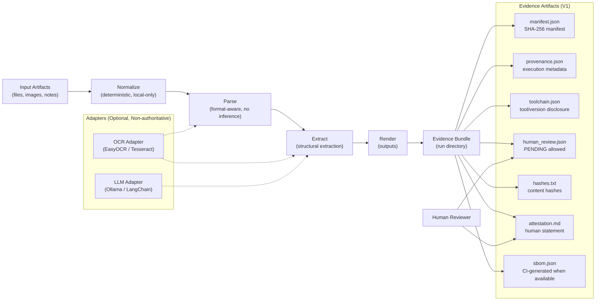

# KProvEngine Architecture (V1)

This document describes the V1 pipeline and evidence flow. It is intentionally
minimal and conservative.

V1 principles:
- The core pipeline is deterministic and local-first.
- OCR/LLM integrations are optional adapters and are non-authoritative.
- Human review is explicit and captured as evidence artifacts.

## V1 Pipeline and Evidence Flow

    
